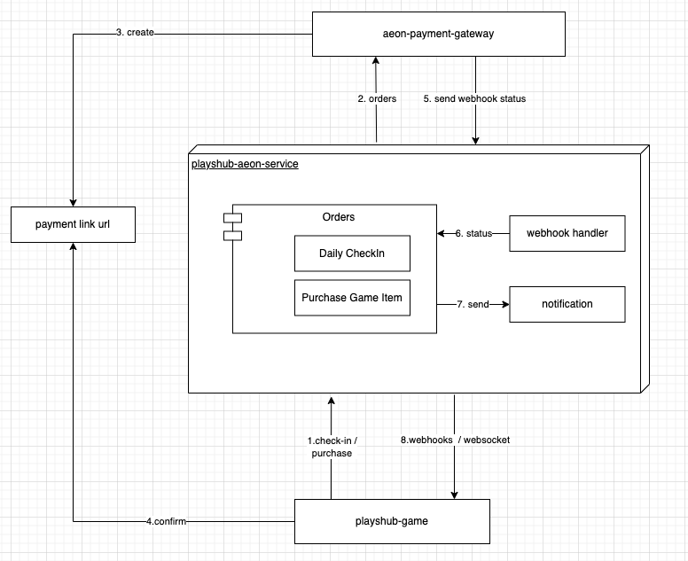

# Playshub x AEON

- Playshub x AEON protocol integration. [aeon-docs](https://aeon-xyz.readme.io/docs/create-order-bot-telegram-cp)



- Create payment links for user purchasing using AEON payment protocol
- Payment confirmation by AEON webhook callback

# Project Structure

```
playshub-blockchain/
├── src/
│   ├── migrations/
│   ├── modules/
│   │   ├── aeon/
│   │   ├── aeon-webhooks/
│   │   ├── check-in/
│   │   ├── notification/
│   │   ├── purchase/
│   ├── utils/
│   ├── app.controller.ts
│   ├── app.module.ts
│   └── main.ts
├── .gitignore
├── docker-compose.yml
├── Dockerfile
├── package.json
└── README.md
```

- `src/`:` Contains the source code, including components and styles.
- `modules/aeon`: API service for Aeon integrations
- `modules/aeon-webhooks`: Aeon webhooks listener
- `modules/check-in`: Check in module
- `modules/notification`: Send webhooks/websocket for playshub game
- `modules/purchase`: Purchase game item module
- `main.ts`: Entry point for the React application.

# Authors and acknowledgment

Playshub Team

# License

This project is licensed under the MIT License. See the LICENSE file for details.

# Project status

We are still developing this project following the roadmap in here: https://playshub.io/
